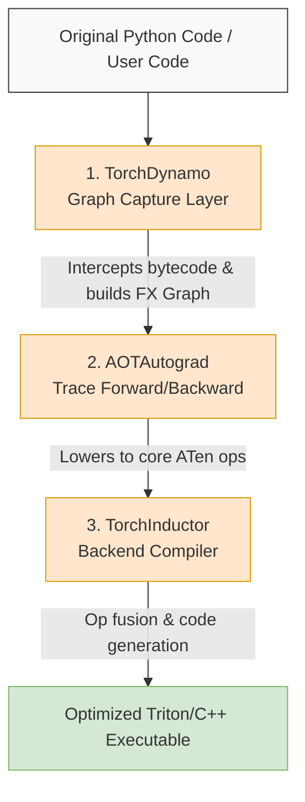
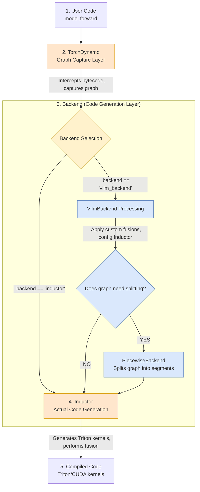
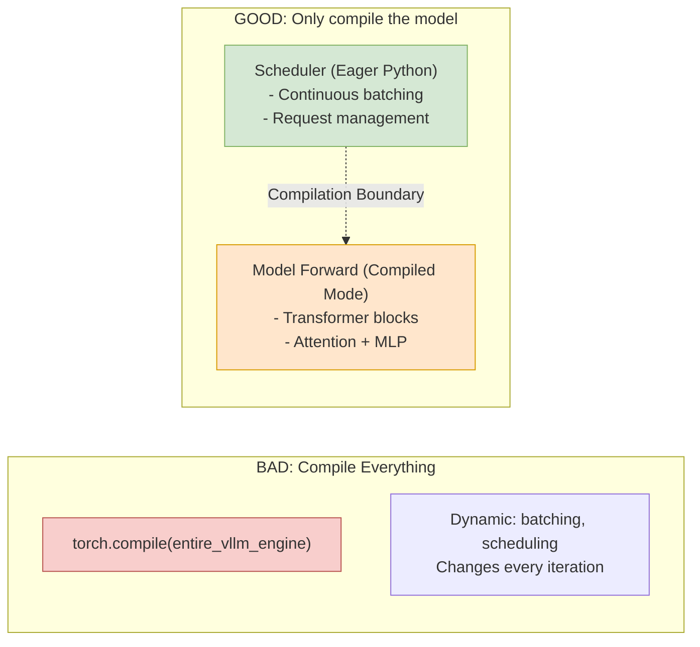
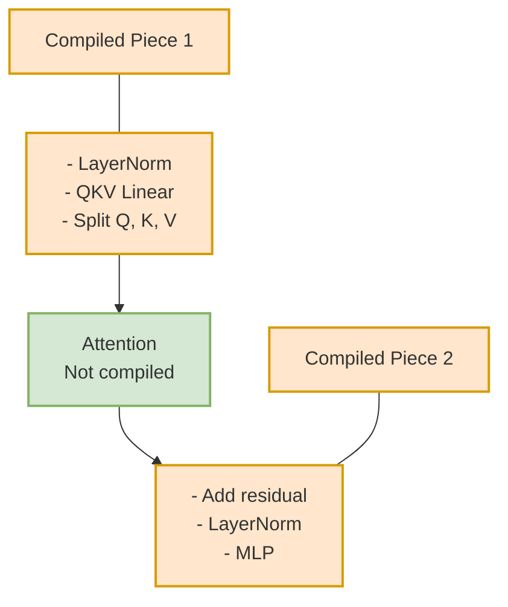
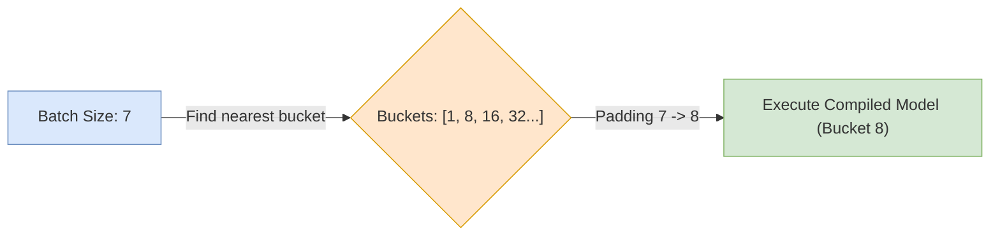

## 1. Introduction: The Next Paradigm Shift in Inference Engines

vLLM fundamentally changed LLM inference efficiency with **PagedAttention** and **Continuous Batching**, successfully solving the system-level "Memory Wall" and "Throughput Wall".
However, as system scheduling optimization reaches its limits, new bottlenecks emerge: **Python Interpreter Overhead** and **Fragmented Kernel Launches**.

**What vLLM Solves (System Level):**
1. PagedAttention -> Better memory efficiency
2. Continuous Batching -> Better throughput

**Challenges at the Operation Level:**
1. Python interpreter overhead
2. Hundreds of small kernel launches
3. Sub-optimal memory access patterns
4. GPU often sits idle waiting for CPU orchestration

*This means there is still room for a 20-40% performance improvement at the operator execution level!*

Simply put, vLLM optimized "what to compute when" but not "how to compute it efficiently".

This is why vLLM is actively integrating `torch.compile`.
[vLLM torch.compile project](https://github.com/orgs/vllm-project/projects/12)

This article will take a deep dive into how vLLM seamlessly integrates PyTorch 2.x compilation technology into its inference engine through three architectural innovations.

---

## 2. What is torch.compile?

1. High-level PyTorch 2.x API for graph compilation:
- Captures your Pytorch code into a computation graph
- Lowers that graph to optimized CPU/GPU/NPU Kernels

2. Key benefits:
- Less Python overhead
- Fewer kernel launches via op fusion
- Better hardware utilization and often higher throughput

```python
import torch

# 1. Define a standard PyTorch model
class SimpleModel(torch.nn.Module):
    def __init__(self):
        super().__init__()
        self.linear = torch.nn.Linear(10, 10)
        self.relu = torch.nn.ReLU()

    def forward(self, x):
        # In native Eager mode, linear and relu here trigger two independent Kernel Launches
        x = self.linear(x) 
        x = self.relu(x)  
        return x

model = SimpleModel().cuda()

# 2. Optimize via torch.compile
# This captures the forward pass into a computation graph and fuses linear and relu (Op Fusion) into a single Kernel
compiled_model = torch.compile(model)

# 3. Execute inference
x = torch.randn(10, 10).cuda()
# The first execution triggers compilation (Warmup); subsequent runs will execute the highly optimized Triton Kernel
out = compiled_model(x)
```

## 3. Torch.compile Pipeline



## 4. vLLM Compilation Pipeline Overview



In vLLM, `torch.compile` is not just a single line of code. It implements a custom `vllm_backend` that processes through the following pipeline:

1. **TorchDynamo (Graph Capture)**: Intercepts Python bytecode, captures the computation graph, and builds the FX Graph representation.
2. **vLLM Backend Processing**: This is the core difference. Custom operator fusions are applied at this level, and Inductor settings are configured based on hardware characteristics.
3. **Inductor (Code Generation)**: Ultimately generates optimized Triton Kernels (GPU) or hardware-specific implementations.

## 5. Four Modes of vLLM Compilation

In vLLM's implementation, there are four levels of mode settings for compilation support:

| Mode | Description |
| :--- | :--- |
| **NONE** | **Pure Eager mode**: No compilation is used; executes as a native PyTorch dynamic graph. |
| **STOCK_TORCH_COMPILE** | **Standard `torch.compile`**: Uses the standard PyTorch compiler without vLLM's custom optimizations. |
| **DYNAMO_TRACE_ONCE** | **Single Dynamo trace**: Performs a single graph capture trace via Dynamo, primarily used for debugging or profiling. |
| **VLLM_COMPILE** | **Custom vLLM Inductor-based**: The ultimate form of vLLM compilation, enabling the dedicated `vllm_backend`, which includes core optimizations like piecewise compilation. |

---

## 6. The 3 Core Innovations of vLLM

To bridge the gap between dynamic LLM inference and static compilation technology, vLLM implemented the following three key innovations:

### Innovation #1: Compilation Boundary
> **Philosophy: Don't compile the scheduler, compile the model.**



If we forcefully compile the entire vLLM engine (including the scheduler), the complex Request management logic (List/Dict operations) would trigger countless **Graph Breaks**.
* **Approach**: Strictly limit the compilation scope to `Model.forward` (Transformer Blocks, Attention, MLP).
* **Value**: The scheduler (Eager Mode) remains highly flexible to handle Requests coming in and out, while the compute-intensive blocks (Compiled Mode) enjoy extreme acceleration.

### Innovation #2: Piecewise Compilation
This is the ultimate solution to the "custom operator conflict". PagedAttention is a highly optimized CUDA Kernel, but to the compiler, it's an impenetrable "black box".



* **Challenge**: The compiler cannot optimize across PagedAttention, often causing graph breaks.
* **Solution**: Precisely "break" the computation graph at the Attention operator boundaries.
    * **Piece 1**: LayerNorm + QKV Linear (Fused by the compiler).
    * **The Gap**: PagedAttention (Retains native hand-written CUDA performance).
    * **Piece 2**: Add Residual + MLP (Fused by the compiler).
* **Benefit**: Retains the peak performance of PagedAttention while allowing the rest of the standard operators to gain compilation optimizations.

### Innovation #3: Shape Bucketing
Dynamic input lengths (Sequence Length) are the natural enemy of compilers.



* **Challenge**: Continuous Batching causes the Shape to change in every iteration, triggering frequent **Re-compilation** and causing severe latency jitter.
* **Solution**: Pre-define a set of static size buckets (e.g., `[1, 8, 16, 32, ...]`).
* **Trade-off**: When the input length is 13, automatically pad it to 16.
* **Analysis**: Although there is a small amount of invalid computation, it buys latency stability. The overhead is calculated as follows:
  $$Overhead = \frac{Bucket\_Size - Actual\_Length}{Bucket\_Size}$$

---

## 7. Professional Insight: From GPU to a Multi-Hardware Ecosystem (NPU & beyond)

As a frontline developer integrating bottom-layer hardware with vLLM, I believe the value of this compilation scheme goes beyond just GPU acceleration.

1. **Standardized Integration**: When supporting alternative hardware like NPUs in the future, we will no longer need to hand-write hundreds of Kernels for every model. As long as the NPU provides a mature Inductor Backend, vLLM can migrate rapidly.

2. **Development Efficiency**: Engineers can focus more on model architecture innovations, leaving low-level operator optimization to the compiler.

---

## 8. Conclusion

vLLM's integration of `torch.compile` has not yet reached its final destination. With the introduction of more complex technologies like **Speculative Decoding**, we will face more dynamic boundary challenges. However, this combination of "Piecewise Compilation" and "Shape Bucketing" has already set a new technical benchmark for high-performance inference engines.

---
**About the Author**: Focused on **hardware-aware optimization** and low-level systems for LLM inference frameworks (vLLM/sglang). Expertise in bridging the gap between cutting-edge models and diverse hardware backends, including **NPU and GPU**. Feel free to connect with me on GitHub or [LinkedIn](https://www.linkedin.com/in/kevin-kuo-745155179/)!
