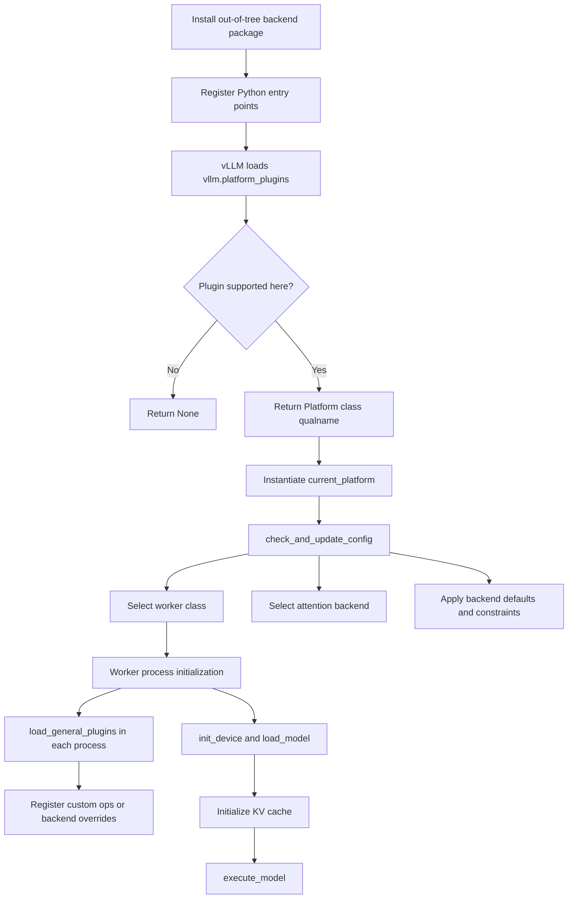

## 1. Introduction: From a CUDA-Centric Engine to a Multi-Hardware Runtime

vLLM started as a high-performance inference engine primarily associated with NVIDIA GPUs, but that is no longer the full picture.

Today, vLLM is evolving into a broader runtime that can support multiple hardware targets, including out-of-tree integrations maintained by accelerator vendors or platform teams. That shift raises a practical question:

**How do you add support for a new hardware backend without carrying a long-lived fork of the vLLM core repository?**

The answer is the hardware plugin workflow.

Modern vLLM already has the extension points needed for this model. A new backend can be packaged as an out-of-tree plugin that:

1. Detects whether the platform is available.
2. Activates a `Platform` implementation.
3. Adjusts runtime configuration for device-specific constraints.
4. Selects a worker implementation.
5. Selects or registers an attention backend.
6. Loads custom ops and communication primitives where needed.

This is what makes "supporting a new accelerator in vLLM" practical without forcing every vendor to upstream a large amount of hardware-specific code into the core tree.

---

## 2. Why Hardware Support Is More Than Device Detection

At first glance, hardware enablement looks simple:

1. Detect the device.
2. Move the model onto it.
3. Run kernels.

In practice, that is not enough for vLLM.

vLLM is not just a thin wrapper around model execution. It is a full inference runtime with assumptions about:

1. Worker lifecycle
2. KV-cache structure
3. Attention backend selection
4. Distributed communication
5. Runtime configuration
6. Scheduling behavior

That means a real hardware port usually needs to answer several separate questions:

1. How does vLLM know this platform is available?
2. Which platform implementation should become active?
3. Which worker class should be used?
4. Which attention backend is valid on this device?
5. What KV-cache layout does that backend expect?
6. Which custom ops or collective communication paths are required?

This is exactly why the plugin system matters. Hardware support is not a single hook. It is a layered integration problem.

---

## 2.5 The Prerequisite: Why PyTorch Support Is Your "Entry Ticket"

Before writing a vLLM plugin, there is one non-negotiable requirement: **Your hardware must already have a PyTorch backend.**

vLLM's model executor is built on PyTorch. This means it expects to work with `torch.Tensor` objects and execute standard PyTorch operators (like `torch.add`, `torch.matmul`, etc.). To even begin the vLLM integration, your hardware must support PyTorch in **eager mode** at a minimum.

### Why Eager Mode Is Enough to Start
You do not need perfectly optimized custom kernels for every operator on day one. Instead, you need a "binding" layer where PyTorch treats your hardware as a device (often using the `PrivateUse1` dispatch key). 

This allows you to:
1. **Initialize the device:** `torch.device("privateuseone", index)` should work.
2. **Move models:** Standard `model.to(device)` should move weights to your hardware.
3. **Execute models:** vLLM's existing model implementations can run on your hardware immediately, albeit potentially slower than optimized kernels.

Without this foundation, you would be forced to rewrite vLLM's entire model library from scratch. Starting with PyTorch eager mode support allows you to focus the vLLM plugin on the high-level orchestration—scheduling, KV-cache management, and attention—while iteratively replacing slow eager paths with optimized custom ops later.

---

## 3. The Big Picture: End-to-End Backend Activation Flow

At a high level, the workflow looks like this:



The important design point is that vLLM does not treat hardware support as one monolithic extension point. Instead, the integration is split into layers:

1. Platform detection
2. Runtime configuration
3. Worker lifecycle
4. Attention backend selection
5. Custom ops and communication

That layering is what makes out-of-tree backends viable.

---

## 4. How vLLM Discovers a Hardware Plugin

vLLM uses Python entry points for plugin discovery.

For hardware integration, the key entry point group is:

1. `vllm.platform_plugins`

A platform plugin function returns:

1. `None` if the backend is not supported in the current environment
2. The fully qualified class name of the platform implementation if it is supported

Most backend packages also expose:

1. `vllm.general_plugins`

This is commonly used to register custom ops, backend overrides, or other runtime extensions that must be loaded in vLLM processes beyond the initial platform-selection path.

Here is the minimal packaging shape:

```python
from setuptools import setup

setup(
    name="vllm-my-accelerator",
    version="0.1.0",
    packages=["vllm_my_accelerator"],
    entry_points={
        "vllm.platform_plugins": [
            "my_accel = vllm_my_accelerator:platform_plugin",
        ],
        "vllm.general_plugins": [
            "my_accel_ops = vllm_my_accelerator:register_ops",
        ],
    },
)
```

And the module entry points:

```python
def platform_plugin() -> str | None:
    if not is_my_accelerator_available():
        return None
    return "vllm_my_accelerator.platform.MyAcceleratorPlatform"


def register_ops() -> None:
    import vllm_my_accelerator.custom_ops  # noqa: F401
```

Two practical rules matter here:

1. Plugin loading can happen in multiple processes, so registration code should be re-entrant.
2. Only one out-of-tree platform plugin can be activated at a time, so the detection logic needs to be precise rather than optimistic.

---

## 5. Step 1: Implement a `Platform` Subclass

The `Platform` class is the control plane for a backend.

It tells vLLM what kind of device is active and how the engine should adapt its runtime behavior for that device. Out-of-tree backends typically start by subclassing `vllm.platforms.interface.Platform`.

```python
from vllm.platforms.interface import Platform, PlatformEnum
from vllm.v1.attention.backends.registry import AttentionBackendEnum


class MyAcceleratorPlatform(Platform):
    _enum = PlatformEnum.OOT
    device_name = "MyAccelerator"
    device_type = "privateuseone"
    dispatch_key = "PrivateUse1"

    @classmethod
    def check_and_update_config(cls, vllm_config) -> None:
        parallel_config = vllm_config.parallel_config
        cache_config = vllm_config.cache_config

        if parallel_config.worker_cls == "auto":
            parallel_config.worker_cls = (
                "vllm_my_accelerator.worker.MyAcceleratorWorker"
            )

        if not cache_config.user_specified_block_size:
            cache_config.block_size = 64

    @classmethod
    def get_attn_backend_cls(
        cls,
        selected_backend: AttentionBackendEnum | None,
        head_size: int,
        dtype,
        kv_cache_dtype,
        block_size: int,
        use_v1: bool,
        use_mla: bool,
    ) -> str:
        return "vllm_my_accelerator.attention.MyAcceleratorAttentionBackend"

    @classmethod
    def get_device_communicator_cls(cls) -> str:
        return "vllm_my_accelerator.communicator.MyAcceleratorCommunicator"
```

This class may look small, but it carries a lot of architectural weight.

### What the platform is really responsible for

The most important hook is usually `check_and_update_config(...)`.

This is where a backend translates generic vLLM configuration into something the actual device can support. Built-in platforms use this kind of hook to do things like:

1. Set the worker class
2. Choose or constrain block size
3. Disable unsupported execution modes
4. Adjust backend defaults
5. Enforce compatibility rules around KV cache, parallelism, or graph execution

For a new accelerator, this is where you encode statements like:

1. "Use this worker implementation."
2. "This block size is required."
3. "This execution mode is unsupported."
4. "This distributed backend must be used."

Without this layer, a backend may appear to work at the kernel level while still failing because the rest of the engine is configured with assumptions from another platform.

---

## 6. Step 2: Implement a Worker

If the platform is the control plane, the worker is the execution plane.

The worker owns the device lifecycle and the model runtime. In vLLM V1, this usually means subclassing `vllm.v1.worker.worker_base.WorkerBase` and implementing the methods that let the engine initialize the device, load the model, manage KV cache, and execute model steps.

```python
import torch

from vllm.v1.worker.worker_base import WorkerBase


class MyAcceleratorWorker(WorkerBase):

    def init_device(self) -> None:
        self.device = torch.device("privateuseone", self.local_rank)
        # Initialize runtime, streams, handles, and device state here.

    def load_model(self, *, load_dummy_weights: bool = False) -> None:
        # Load model weights onto the device and build the model runner.
        pass

    def get_kv_cache_spec(self):
        raise NotImplementedError

    def compile_or_warm_up_model(self) -> float:
        return 0.0

    def get_model(self):
        return self.model_runner

    def execute_model(self, scheduler_output):
        raise NotImplementedError

    def sample_tokens(self, grammar_output):
        raise NotImplementedError

    def get_cache_block_size_bytes(self) -> int:
        raise NotImplementedError

    def add_lora(self, lora_request) -> bool:
        raise NotImplementedError

    def remove_lora(self, lora_id: int) -> bool:
        raise NotImplementedError

    def pin_lora(self, lora_id: int) -> bool:
        raise NotImplementedError

    def list_loras(self) -> set[int]:
        raise NotImplementedError
```

The exact implementation surface depends on how much feature coverage you want, but the core responsibilities are usually:

1. Device initialization
2. Model loading
3. KV-cache specification
4. KV-cache allocation and sizing
5. Per-step model execution
6. Optional compilation or warmup

This is typically the largest part of the backend port.

A platform can be detected in a few lines. A worker is where the runtime becomes real.

---

## 7. Step 3: Implement an Attention Backend

In vLLM, attention is not just an internal detail hidden inside the worker.

It is a first-class abstraction with:

1. Capability checks
2. Selection logic
3. Validation rules
4. KV-cache layout semantics

That is why most serious hardware ports also need an `AttentionBackend` implementation.

```python
import torch

from vllm.v1.attention.backend import AttentionBackend


class MyAcceleratorAttentionBackend(AttentionBackend):
    supported_dtypes = [torch.float16, torch.bfloat16]
    supported_kv_cache_dtypes = ["auto", "float16", "bfloat16"]

    @staticmethod
    def get_name() -> str:
        return "MY_ACCEL"

    @staticmethod
    def get_impl_cls():
        return MyAcceleratorAttentionImpl

    @staticmethod
    def get_builder_cls():
        return MyAcceleratorMetadataBuilder

    @staticmethod
    def get_kv_cache_shape(
        num_blocks: int,
        block_size: int,
        num_kv_heads: int,
        head_size: int,
        cache_dtype_str: str = "auto",
    ) -> tuple[int, ...]:
        return (2, num_blocks, block_size, num_kv_heads, head_size)

    @classmethod
    def get_supported_head_sizes(cls) -> list[int]:
        return [64, 128, 256]
```

Why this abstraction matters:

1. vLLM validates whether the backend supports a given dtype, head size, block size, and KV-cache dtype.
2. Automatic backend selection depends on those validations.
3. The KV-cache layout is backend-defined, so it must match what the kernels actually expect.

This separation is important:

1. The platform answers: "Which attention backend should this device use?"
2. The attention backend answers: "What does this implementation support, and how is KV cache laid out?"

That is a clean division of responsibility.

---

## 8. Step 4: Decide Whether to Register a Named Attention Backend

In practice, there are two ways to use a custom attention backend.

### Option A: Return it directly from the platform

This is the simplest path.

Your platform's `get_attn_backend_cls(...)` returns the fully qualified class path for the backend implementation, and users do not need to know about a new public backend name.

This works well when the attention backend is tightly coupled to one hardware plugin.

### Option B: Register it through the attention backend registry

If you want users to explicitly select the backend, or you want to override a named backend path, you can register it through `vllm.v1.attention.backends.registry.register_backend(...)`.

```python
from vllm.v1.attention.backends.registry import (
    AttentionBackendEnum,
    register_backend,
)


def register_ops() -> None:
    register_backend(
        AttentionBackendEnum.CUSTOM,
        "vllm_my_accelerator.attention.MyAcceleratorAttentionBackend",
    )
```

This path is useful when:

1. You want the backend to be user-selectable.
2. You want to experiment with an alternate backend implementation.
3. You want the integration to participate directly in the backend registry flow.

The key point is that "hardware plugin" and "attention backend registration" are related, but they are not the same layer.

1. The platform controls device integration.
2. The attention backend controls kernel capability and layout semantics.

---

## 9. Step 5: Add Custom Ops and Communication

A backend can often start with PyTorch-native operations, but that is rarely enough for production serving performance.

That is where general plugins and custom ops become important.

Depending on the hardware stack, a production-grade backend may need:

1. Custom torch ops
2. Backend-specific kernel wrappers
3. Rotary embedding overrides
4. All-reduce or all-gather implementations
5. A custom device communicator

The out-of-tree dummy platform test plugin in vLLM demonstrates this pattern in lightweight form by registering extra behavior through a general plugin.

One minimal example looks like this:

```python
from vllm.model_executor.layers.rotary_embedding import RotaryEmbedding


@RotaryEmbedding.register_oot
class MyRotaryEmbedding(RotaryEmbedding):

    def forward_oot(self, *args, **kwargs):
        return super().forward_oot(*args, **kwargs)
```

If the backend supports distributed execution, you will usually also implement a custom communicator and return it from `get_device_communicator_cls()`.

That is more than a performance detail. For many accelerators, distributed communication is part of baseline correctness for tensor parallel or pipeline parallel execution.

---

## 10. Step 6: Design for Multi-Process Loading From Day One

One subtle but important aspect of vLLM's plugin model is that plugin code is not loaded only once in one main Python process.

vLLM may load plugin logic in multiple contexts, including:

1. Engine startup
2. Worker initialization
3. Distributed execution
4. Async serving paths

In the V1 worker flow, `load_general_plugins()` is explicitly called during worker initialization.

That leads to two practical requirements:

1. Registration code should be re-entrant.
2. Import-time side effects should be controlled and predictable.

This is easy to miss during early bring-up because a single-process prototype may appear to work perfectly. The issue often appears only when the backend is moved into real multi-process serving.

---

## 11. A Minimal Out-of-Tree Backend Layout

A practical starting layout for a new backend package looks like this:

```text
vllm-my-accelerator/
├── setup.py
└── vllm_my_accelerator/
    ├── __init__.py
    ├── platform.py
    ├── worker.py
    ├── attention.py
    ├── communicator.py
    └── custom_ops.py
```

You can start with fewer files than this, but most production backends eventually converge on something close to this shape.

---

## 12. What "Supporting a New Backend" Usually Means in Stages

In practice, hardware enablement does not happen all at once. It usually progresses in layers.

### Stage 1: Bring-Up

Goal:

1. The backend is detected.
2. The worker starts.
3. The model loads.
4. One inference path runs.

At this stage, some operators may still be slow or implemented with fallback code.

### Stage 2: Correctness

Goal:

1. KV-cache layout is stable.
2. Attention validation is correct.
3. Multi-rank execution works.
4. Common features stop crashing.

This is the stage where backend-specific constraints should be encoded in configuration and validation logic rather than left as tribal knowledge.

### Stage 3: Performance

Goal:

1. Custom ops replace slow fallbacks.
2. Communication is optimized.
3. Warmup or compilation is tuned.
4. Backend-specific defaults are applied automatically.

This is the point where the backend stops being merely functional and starts feeling native inside vLLM.

---

## 13. Common Mistakes When Porting a New Accelerator

A few failure modes show up repeatedly:

1. Treating platform detection as the whole integration.
2. Returning an attention backend class without validating its full capability surface.
3. Forgetting that general plugins can load in multiple processes.
4. Carrying CUDA assumptions into a non-CUDA backend.
5. Leaving `worker_cls` unset and expecting the engine to infer the correct worker.
6. Ignoring KV-cache layout semantics until late in the port.
7. Building a demo that runs one model, but never encoding the backend's real constraints in `check_and_update_config(...)`.

The strongest hardware ports are usually the ones that make constraints explicit early.

---

## 14. A Useful Mental Model for the Architecture

A good way to think about the hardware plugin workflow is:

1. The platform decides how vLLM should behave on this device.
2. The worker executes the runtime lifecycle.
3. The attention backend defines kernel compatibility and KV-cache semantics.
4. General plugins register supporting functionality wherever it is needed.

Those layers are separate for a reason.

vLLM is not just calling one kernel in a loop. It is coordinating a full inference runtime, and each layer exists to keep that runtime extensible.

---

## 15. Final Takeaway

If you want to support a new hardware backend in vLLM, do not think of it as "adding one more device type."

Instead, think of it as teaching vLLM five things:

1. How to detect the platform
2. How to configure itself safely for that platform
3. How to initialize and run workers on it
4. How to select and validate an attention implementation
5. How to register the custom ops and communication paths needed for real performance

That is the hardware plugin workflow.

The payoff is significant: once those boundaries are respected, accelerator teams can move much faster out of tree, without forcing every backend into a permanent fork of vLLM core.

---

## 16. References

- [https://github.com/vllm-project/vllm](https://github.com/vllm-project/vllm)
- [https://docs.vllm.ai/en/latest/design/plugin_system/](https://docs.vllm.ai/en/latest/design/plugin_system/)
- [https://github.com/vllm-project/vllm-ascend](https://github.com/vllm-project/vllm-ascend)
- [https://github.com/vllm-project/vllm/issues/11162](https://github.com/vllm-project/vllm/issues/11162)

---
**About the Author**: Focused on **hardware-aware optimization** and low-level systems for LLM inference frameworks (vLLM/sglang). Expertise in bridging the gap between cutting-edge models and diverse hardware backends, including **NPU and GPU**. Feel free to connect with me on GitHub or [LinkedIn](https://www.linkedin.com/in/kevin-kuo-745155179/)!
